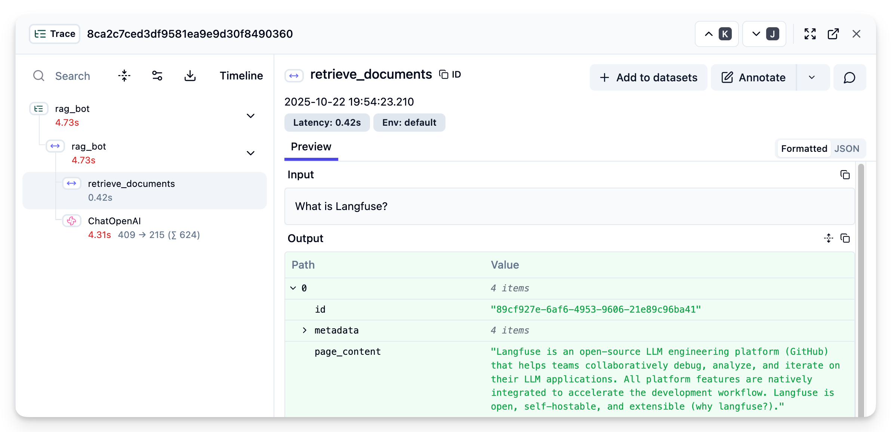
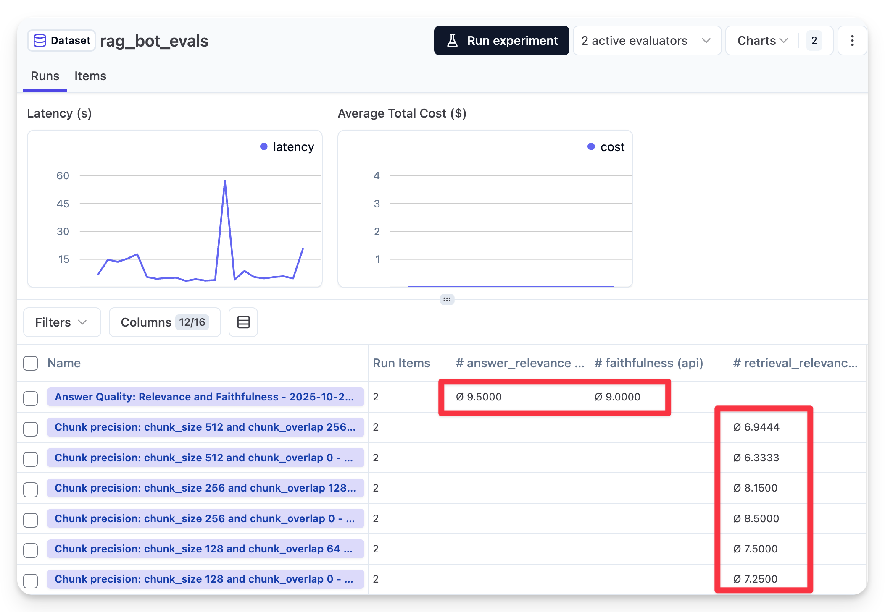

# RAG Obvservability and Evals with Langfuse

A RAG (Retrieval-Augmented Generation) chatbot that answers questions about Langfuse using OpenAI and LangChain, with observability and evals.

Follow the Langfuse blogpost on [RAG Observability and Evals](https://langfuse.com/blog/2025-10-28-rag-observability-and-evals) for more details.

## Features

- **Observability**: Full tracing of the RAG pipeline with Langfuse
- **Component Evaluation**: Example evaluation for the chunk retrieval with Langfuse Experiments
- **Evaluation**: Evaluation of the entire RAG pipeline with Langfuse Experiments

## Requirements

• Python ≥3.11
• OpenAI API key
• Langfuse credentials

## Setup

Create .env with:

```
OPENAI_API_KEY=your_key
LANGFUSE_PUBLIC_KEY=your_key
LANGFUSE_SECRET_KEY=your_key
LANGFUSE_HOST=https://cloud.langfuse.com
```

And install the dependencies:

```sh
uv sync
```

## Usage

### For Observability

Run the bot:

```
uv run rag_bot/main.py
```

You should see traces in Langfuse like this:



### Evaluations

Create a dataset in Langfuse with the following name: `rag_bot_evals`

Each item in the dataset should have the following fields:

- input: `{ "question": "What is Langfuse?" }`
- expected_output: `{ "answer": "Langfuse is a platform for building and evaluating LLMs." }`

#### a. Answer Evaluation

```
uv run rag_bot/answer_evaluation.py
```

#### b. Component Evaluation

An example is provided to evaluate the right chunk size and overlap:

```
uv run rag_bot/chunk_evaluation.py
```

You should see the evaluation results in Langfuse like this:


