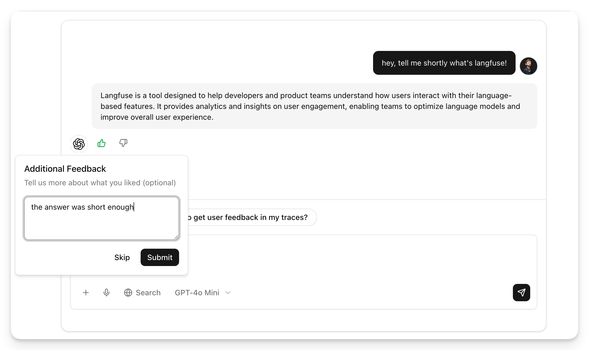
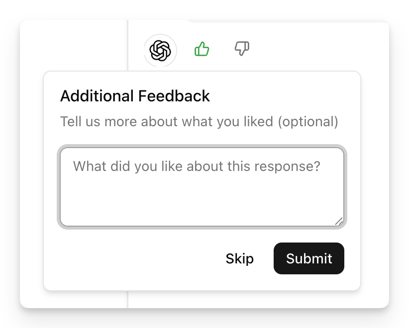
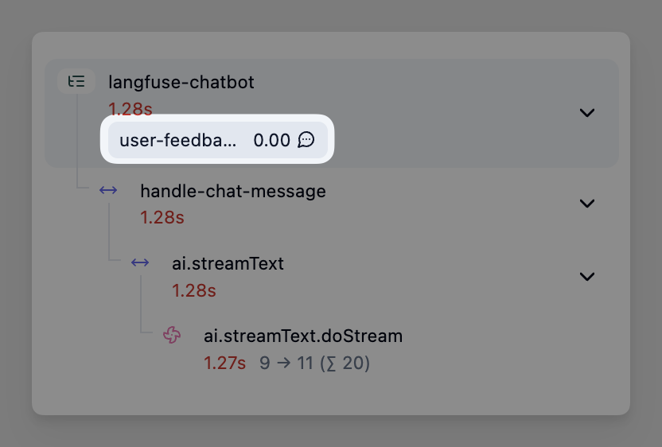

# User Feedback with Langfuse

A Next.js chat application demonstrating how to collect and integrate user feedback into Langfuse traces for AI observability and evaluation.



## Key Features

- **Real-time Feedback Collection**: Thumbs up/down rating with optional comments on AI responses
- **Langfuse Tracing**: Full observability of LLM calls with OpenTelemetry integration
- **Feedback-to-Trace Linking**: User feedback automatically sent to Langfuse as scores tied to specific traces
- **Session Management**: Track conversation context across multiple messages

## Prerequisites

- Node.js 18+
- OpenAI API key
- Langfuse credentials

## Setup

1. Install dependencies:

```bash
npm install
```

2. Create `.env` file with your API keys:

```bash
# OpenAI API Key
OPENAI_API_KEY=your-openai-api-key

# Langfuse Configuration
NEXT_PUBLIC_LANGFUSE_HOST=https://cloud.langfuse.com
NEXT_PUBLIC_LANGFUSE_PUBLIC_KEY=pk-lf-fe2c726b-38cd-4068-be67-d3f786499b82
LANGFUSE_SECRET_KEY=sk-lf-...
```

Get your Langfuse keys from [https://cloud.langfuse.com](https://cloud.langfuse.com)

## How to Run

Start the development server:

```bash
npm run dev
```

Open [http://localhost:3000](http://localhost:3000) with your browser to interact with the chat interface.

## How It Works

### 1. Tracing LLM Calls

The application uses Langfuse's OpenTelemetry integration to automatically trace all LLM calls:

- Each chat message generates a trace in Langfuse with session tracking
- Traces capture input, output, model used, and token usage
- The trace ID is used as the message ID for linking feedback

### 2. Collecting User Feedback

Users can provide feedback on AI responses through:

- **Thumbs up/down**: Simple binary feedback (1 or 0)
- **Optional comments**: Additional context about the rating

The feedback UI appears below each assistant message in the chat interface.



### 3. Sending Feedback to Langfuse

When a user provides feedback, it's automatically sent to Langfuse as a score:

```typescript
langfuse.score({
  traceId: messageId,        // Links to the original trace
  id: `user-feedback-${messageId}`,
  name: "user-feedback",
  value: value,              // 1 for thumbs up, 0 for thumbs down
  comment: comment,          // Optional user comment
});
```

### 4. Viewing Feedback in Langfuse

In your Langfuse dashboard, you can:

- View user feedback scores alongside traces
- Filter traces by feedback ratings
- Analyze patterns in user satisfaction
- Use feedback for model evaluation and improvement



## Learn More

- [Langfuse Documentation](https://langfuse.com/docs)